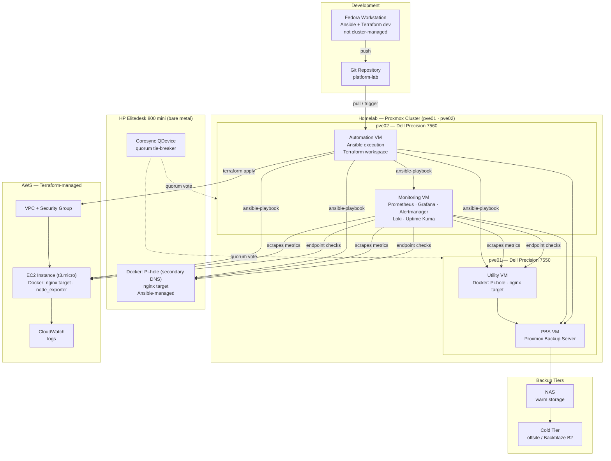
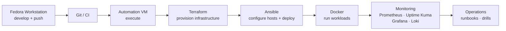
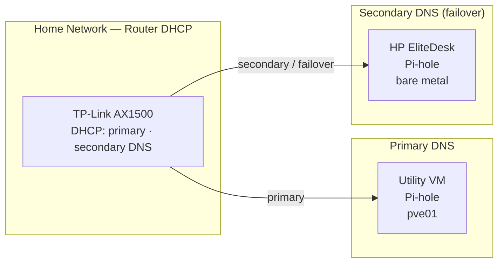
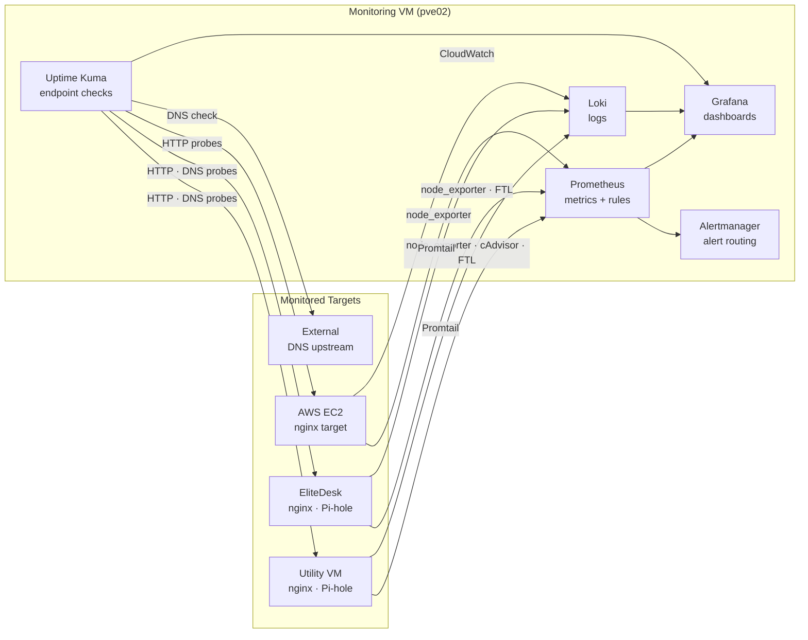
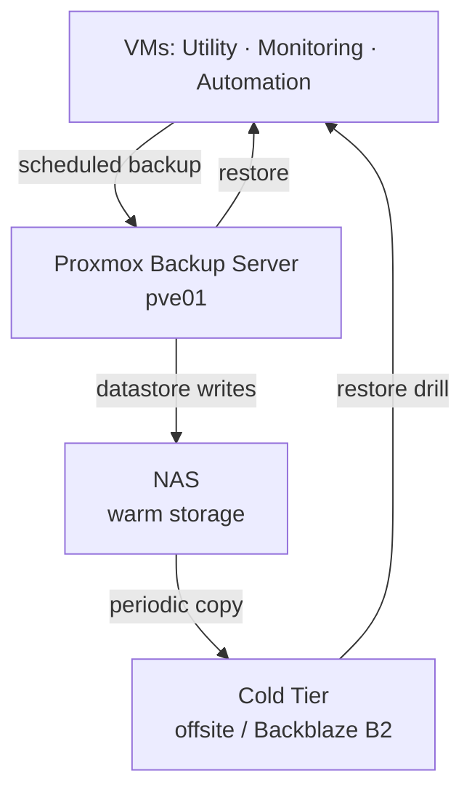
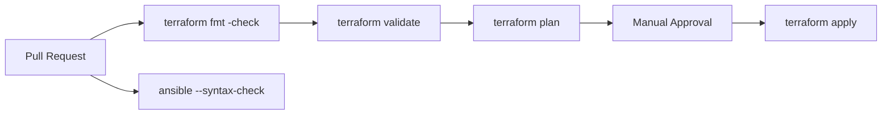

# Platform Diagrams

---

## Platform Architecture

---

## Automation Flow

---

## Pi-hole DNS Failover

> Both instances are deployed via the same Ansible role. The EliteDesk instance is activated as secondary DNS during the whole-home cutover (Milestone 8).

---

## Observability Layer

---

## Backup and Recovery

---

## CI/CD Pipeline

